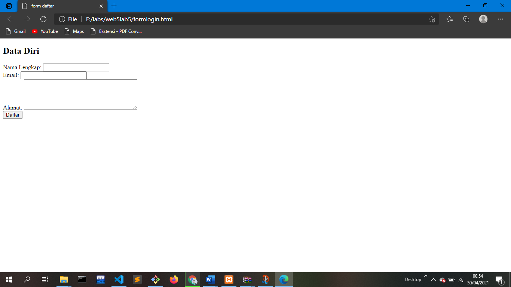
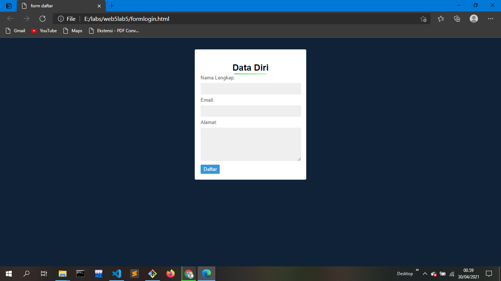
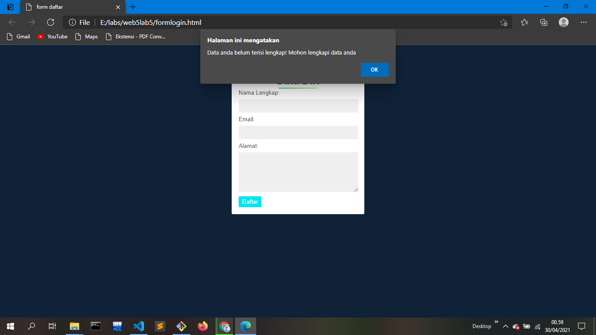

# web5lab5
# web4lab4
## Belajar Javasript 

### Membuat validasi pada html dan css dengan javascript
Berikut prosesnya:

# Pertama kita buat laman htmlnya

    <!DOCTYPE html>
    <html lang="en">
    <head>
    <meta charset="UTF-8">
    <meta http-equiv="X-UA-Compatible" content="IE=edge">
    <meta name="viewport" content="width=device-width, initial-scale=1.0">
    <title>Document</title>
    </head>
    <body>
    </body>
    </html>

    setelah itu masukan element dibawah ini di antara "<body> </body>"

    

		<h2>Data Diri</h2>
		

			

				<label>Nama Lengkap:</label>
				<input type="text" name="nama" id="nama" />
			

			

				<label>Email:</label>
				<input type="email" name="email" id="email" />
			

			

				<label>Alamat:</label>
				<textarea cols="40" rows="5" name="alamat" id="alamat"></textarea>
			

			

				<input type="submit" value="Daftar" class="tombol">
			

	

 
# maka hasilnya akan seperti ini :

masukan 

    "<form action="#" method="POST" onSubmit="validasi()"></form>"
Dan tambahkan script dibawah </body>

    

# Agar tampilannya lebih menarik, tambahkan CSSnya

body {
  background: #0f2238;
  font-family: sans-serif;
}
 
h2 {
  color: rgb(0, 0, 0);
  text-align: center;
}
 
.login {
  padding: 1em;
  margin: 2em auto;
  width: 17em;
  background: #fff;
  border-radius: 3px;
}
 
label {
  font-size: 10pt;
  color: #555;
}
 
input[type="text"],
input[type="email"],
textarea {
  padding: 8px;
  width: 95%;
  background: #efefef;
  border: 0;
  font-size: 10pt;
  margin: 6px 0px;
}
 
.tombol {
  background: #3498db;
  color: #fff;
  border: 0;
  padding: 5px 8px;
}
.tombol:hover {background-color: #00E5EE}
.tombol:active {
  background-color: rgb(170, 95, 95);
  box-shadow: 0 5px #666;
  transform: translateY(2px);
}
.underline-title {
    background: -webkit-linear-gradient(right, #a6f77b, #2ec06f);
    height: 2px;
    margin: -1.1rem auto 0 auto;
    width: 89px;
}

# Berikut hasil akhirnya  :

# Jadi jika kita tidak lengkap saat mengisi data, maka ada pemberitahuan yang muncul.

